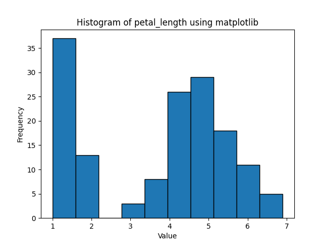
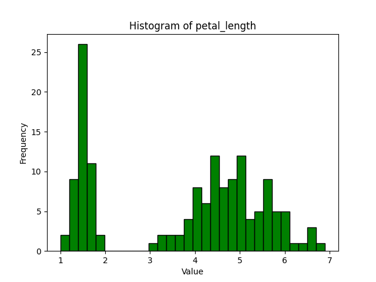
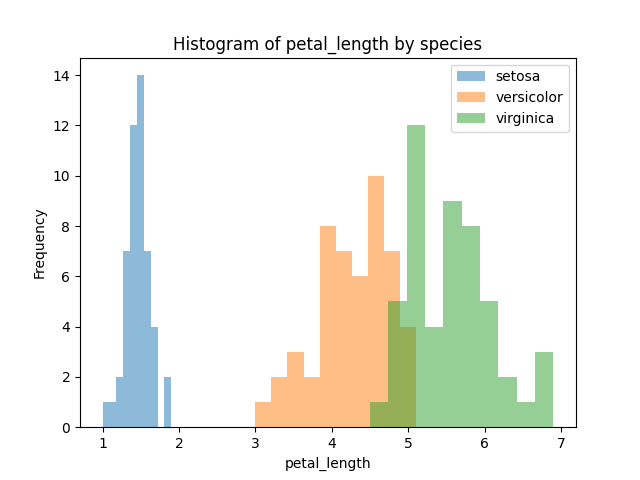
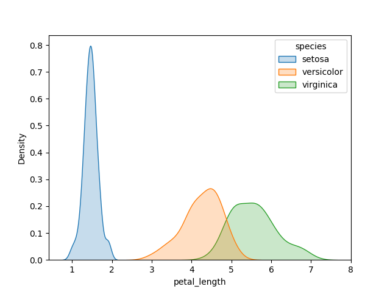
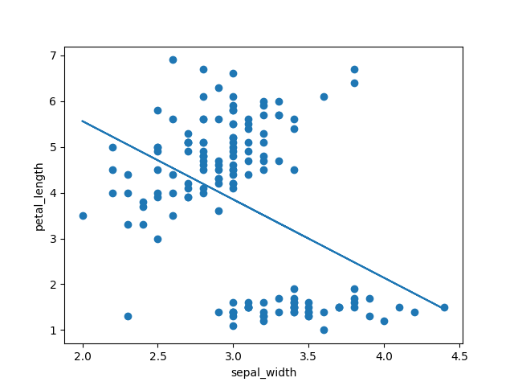

# The Iris Dataset

***

This repository contains an analysis of the Iris dataset.[1.0]


*Iris flowers [1.1]*

Original data was collected by Edgar Anderson, and made famous by Ronald Fisher.[2] The Iris dataset has become a benchmark dataset for intorductory data analysis. 

The Iris dataset can be found in UC Irvines Machine Learning repository:

- https://archive.ics.uci.edu/dataset/53/iris

The datset used in this analysis can be found here:    
 
 - https://raw.githubusercontent.com/mwaskom/seaborn-data/master/iris.csv


## About

This program reads in a dataset (csv) and summarizes numerical variables, plots histograms, scatterplots, etc.

This program can be used to analyse ~~any dataset~~ the Iris dataset in csv form. Currently, it will:

- plot histograms of every numeric variable using matplotlib
- plot scatterplots of every pair of numeric variables using matplotlib
- plot lmplots using seaborn of every pair of numeric variables, with a 'hue' of every non-numeric variable in the datset

This will create a lot of plots in the 'plots' directory. You can then weed out the plots that you dont need or like. Next feature to add is checking if the plot is worth plotting or not, maybe add a R^2 check or something ...

Histograms are useful for visualizing distributions.

Kernel Density Estimates are related to histograms

## Quickstart

Install stuff:

```
python pip install pandas matplotlib seaborn os
git clone https://github.com/holmstead/pands-project.git
```

Run the program:
git push
```
python analysis.py example_dataset.csv
```


## Get Started

Requirements:

- Python 3.x
- pandas
- matplotlib
- seaborn
- os

Python is a general purpose programming language. The Python interperter can be downloaded [here](https://www.python.org/downloads/).

1. Install `pandas`
    - https://pandas.pydata.org/

2. Install `matplotlib`
    - https://matplotlib.org/

3. Install `seaborn`
    - https://seaborn.pydata.org/


Once everything is installed, run the following command in the console: 

```
python analysis.py example_dataset.csv
```


## Analysis

**elaborate on the difference between a dataframe and a series.

Pandas built-in hist method can give overview of dataframe:


We can plot histograms of individual variables from the dataframe:



Pandas has built in hist method. Can select how many bins too in both methods.



Thats still not showing us by species though, thats for all species in the dataframe combined.

We can group them using pandas and groupby() method:



KDE plots are related to histograms:




Matplotlib basic scatterplot of two variables:


We can't tell which species or anything though.


##  Contribute

Pull requests to holmstead@protonmail.com.


## References

[^1.0] https://archive.ics.uci.edu/dataset/53/iris

[1.1] https://peaceadegbite1.medium.com/iris-flower-classification-60790e9718a1

[^2] https://en.wikipedia.org/wiki/Iris_flower_data_set


## Author

M. Holmes, 2024

email: holmstead@protonmail.com


