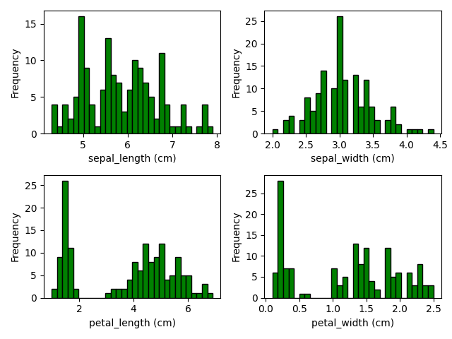
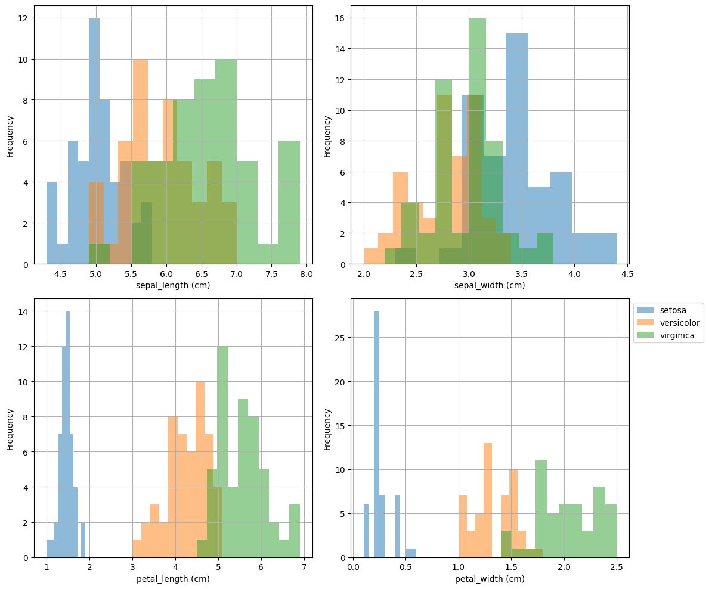

# The Iris Dataset

This repository contains an analysis of the Iris dataset.[1]


*Iris flowers [1.1]*

Original data was collected by Edgar Anderson, and made famous by Ronald Fisher.[2] The Iris dataset has become a benchmark dataset for intorductory data analysis. 

The Iris dataset can be found in UC Irvines Machine Learning repository:

- https://archive.ics.uci.edu/dataset/53/iris

The datset used in this analysis can be found here:    
 
 - https://raw.githubusercontent.com/mwaskom/seaborn-data/master/iris.csv

The program was written in Python using VSCode, a free open-source Integrated Development Environment (IDE).

Several ibraries were used that are not part of the Python Standard Library and must be downloaded seperately. Instructions on how to install these libraries can be found in the Get Started section.

There is an online repository called the Python Package Index (PyPI) which helps find and install packages developed by the Python community.

    https://pypi.org/


## 1. About

This program reads in a dataset (csv) and summarizes numerical variables, plots histograms, scatterplots, etc.

**elaborate on the difference between a dataframe and a series.

This program can be used to analyse ~~any dataset~~ the Iris dataset in csv form. Currently, it will:

- output a statistical summary of the dataframe to a textfile
- plot histograms of every numeric variable using matplotlib and pandas
- plot combined histograms in one figure
- plot Kernel Density Estimations
- plot histogram and KDE on one fig using Seaborn
- plot scatterplots of every pair of numeric variables using matplotlib, with line of best fit
- plot pairplot using seaborn
- plot a heatmap depicting the correlation between variables


This will create a _lot_ of plots in the 'plots' directory. You can then weed out the plots that you dont need or like. Next feature to add is checking if the plot is worth plotting or not, maybe add a R^2 check or something ...


Functions are put into a module call `an.py`. This makes the main `analysis.py` code more readable. The aim was to make these function re-usable so that the analysis program could be modified to read in any dataset in csv form, and produce the same graphs. 

- https://docs.python.org/3/tutorial/modules.html


## Quickstart

Install stuff:

```
python pip install pandas matplotlib seaborn os
```

Clone the repo:

```
git clone https://github.com/holmstead/pands-project.git
```

Run the program:

```
python analysis.py iris.csv
```


## Get Started

Requirements:

- Python 3.x
- Pandas
- matplotlib
- Seaborn
- NumPy
- os

Python is a general purpose programming language. The Python interperter can be downloaded [here](https://www.python.org/downloads/).

More information about the libraries used in this analysis can be found below:

1. Pandas
    - https://pandas.pydata.org/

2. NumPy
    - https://numpy.org/

3. Matplotlib
    - https://matplotlib.org/

4. Seaborn
    - https://seaborn.pydata.org/


Once everything is installed, run the following command in the console: 

```
python analysis.py iris.csv
```


## Analysis

The idea is to churn out heaps of plots, then decide which ones to present.

Pandas can create a load of types of plots:

- https://pandas.pydata.org/pandas-docs/stable/user_guide/visualization.html#visualization-scatter-matrix

Before plotting, check if "plots" directory exists.

- https://www.w3schools.com/python/ref_os_makedirs.asp


###  Pivot tables

Pivot table and calculate mean on the aggregate. 

- https://pandas.pydata.org/pandas-docs/stable/reference/api/pandas.pivot_table.html

We can use pandas plot() function and specify barchart:

- https://pandas.pydata.org/pandas-docs/stable/reference/api/pandas.DataFrame.plot.html

Standard deviation can be calculated and errorbars plotted on the barchart, uses groupby(). yerr is a parameter in the plot function

- https://pandas.pydata.org/pandas-docs/stable/user_guide/visualization.html#visualization-errorbars


### Histograms 

HIstograms are useful for visualizing distributions.

- https://realpython.com/python-histograms/

Matplot is used to plot histograms:

- https://matplotlib.org/stable/api/_as_gen/matplotlib.pyplot.hist.html

Histogram grouped by species:

- https://pandas.pydata.org/pandas-docs/stable/reference/api/pandas.DataFrame.groupby.html

Pandas built-in hist method can give overview of dataframe. Used df.hist() as using df.plot.hist() puts them all on one figure, its a mess ... Stackoverflow user explains:

```
They do different things, df.hist() will produce a separate plot for each Series whilst df.plot.hist() will produce a stacked single plot
```

- https://stackoverflow.com/questions/57008086/df-hist-vs-df-plot-hist

To get an x and y title for shared adapted 
Adapted from:

- https://stackoverflow.com/questions/32685185/pandas-histogram-labels-and-title
    


We can plot histograms of individual variables e.g. petal length (these are called a Series) from the dataframe:


Pandas has built in hist method. Can select how many bins too in both methods. Combining the histograms of ecah of the variables onto one figure gives us a better overview of the dataset:



Thats still not showing us by species though, thats for all species in the dataframe combined.

We can group them using pandas and groupby() method:


We can put the grouped histograms of each variable onto one figure also. Had to make the figure larger to accomodate the titles ...



### Kernel Density Estimates (KDE)

KDE plots are related to histograms.

- https://en.wikipedia.org/wiki/Kernel_density_estimation

Seaborn is used to plot KDE

- https://seaborn.pydata.org/generated/seaborn.kdeplot.html


### Scatterplots

Scatterplots

- https://matplotlib.org/stable/api/_as_gen/matplotlib.pyplot.scatter.html


Matplotlib scatterplot of two variables. Coloured by species. Added a line of best fit using polyfit(), and displayed the equation of the line in the legend.


### Heatmaps

Heatmaps

- https://seaborn.pydata.org/generated/seaborn.heatmap.html


### Combined plots

Pairplots combine a lot of useful visuals into one easy to create figure:

- https://seaborn.pydata.org/generated/seaborn.pairplot.html

Pairplot plots "pairwise relationships in a dataset." 


##  Contribute

Pull requests to holmstead@protonmail.com.


## References

[^1] https://archive.ics.uci.edu/dataset/53/iris

[1.1] https://peaceadegbite1.medium.com/iris-flower-classification-60790e9718a1

[^2] https://en.wikipedia.org/wiki/Iris_flower_data_set


## Author

M. Holmes, 2024

email: holmstead@protonmail.com


