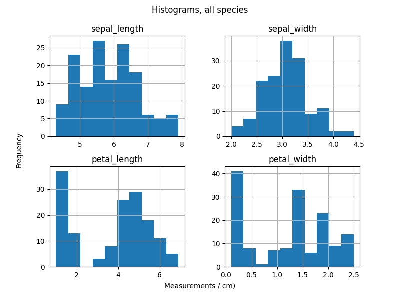
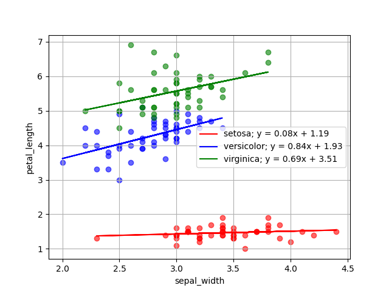

# The Iris Dataset

This repository contains an analysis of the Iris dataset.[1]


*Iris flowers [source: https://peaceadegbite1.medium.com/iris-flower-classification-60790e9718a1]*

The original data was collected by Edgar Anderson, and made famous by Ronald Fisher.[2] The Iris dataset has become a benchmark dataset for intorductory data analysis. 

The Iris dataset can be found in [UC Irvines Machine Learning repository](https://archive.ics.uci.edu/dataset/53/iris). The datset used in this analysis  can be found below (it's nicely formatted):    
 
 - https://raw.githubusercontent.com/mwaskom/seaborn-data/master/iris.csv

The program was written in Python using [VSCode](https://code.visualstudio.com/), a free open-source Integrated Development Environment (IDE).

Several libraries were used that are not part of the Python Standard Library and must be downloaded seperately. Instructions on how to install these libraries can be found in the Get Started section.

There is an online repository called the Python Package Index (PyPI) which helps find and install packages developed by the Python community.

    https://pypi.org/


## 1. About

This program analyse the Iris dataset. It reads in the dataset (in csv form) and summarizes numerical variables, plots histograms, scatterplots, etc. Currently, it will:

- output a statistical summary of the dataframe to a textfile (variables.txt)
- plot histograms of every numeric variable
- plot combined histograms in one figure
- plot Kernel Density Estimations
- plot histogram and KDE on one fig using Seaborn
- plot scatterplots of every pair of numeric variables using matplotlib, with line of best fit
- plot pairplot using seaborn
- plot a heatmap depicting the correlation between variables

This will create a _lot_ of plots in the 'plots' directory. You can then weed out the plots that you dont need or like. Next feature to add is checking if the plot is worth plotting or not, maybe add an R^2 check ...

Functions are put into a [module](https://docs.python.org/3/tutorial/modules.html) call `an.py`. This makes the main `analysis.py` code more readable.


## Get Started

Requirements:

- Python 3.x
- Pandas
- matplotlib
- Seaborn
- NumPy
- os

Python is a general purpose programming language. The Python interperter can be downloaded [here](https://www.python.org/downloads/).

Install dependencies by opening the command line and running the following command:

```
python pip install pandas matplotlib seaborn os
```

Then clone the repository:

```
git clone https://github.com/holmstead/pands-project.git
```

Once everything is installed and the repository cloned, you can run a program by using the following command:

```
python analysis.py iris.csv
```


More information about the libraries used in this analysis can be found in the links below:

1. Pandas
    - https://pandas.pydata.org/

2. NumPy
    - https://numpy.org/

3. Matplotlib
    - https://matplotlib.org/

4. Seaborn
    - https://seaborn.pydata.org/


## Analysis

A statistical analysis of the dataset is performed using Pandas built-in describe() method:

- https://pandas.pydata.org/pandas-docs/stable/reference/api/pandas.DataFrame.describe.html

The output of which is written to a file called variables_summary.txt. Here we can see the mean, standard deviation etc. of each of the numeric variables in the dataset.

Pandas can create a load of different types of plots:

- https://pandas.pydata.org/pandas-docs/stable/user_guide/visualization.html#visualization-scatter-matrix

Before doing any plotting, we check if "plots" directory exists using os.makedir() method:

- https://www.w3schools.com/python/ref_os_makedirs.asp


###  Pivot tables

A "spread-sheet style pivot table" can be created using Pandas to aggregate data in useful ways for visualisation. We can create a pivot table and calculate the mean on the aggregate using the pivot_table () function:

- https://pandas.pydata.org/pandas-docs/stable/reference/api/pandas.pivot_table.html

We can then use Pandas' plot() function and specify barchart:

- https://pandas.pydata.org/pandas-docs/stable/reference/api/pandas.DataFrame.plot.html

The standard deviation can be calculated and error-bars plotted on the barchart using the groupby() function. "yerr" is a parameter we can set as an arguement in the plot function:

- https://pandas.pydata.org/pandas-docs/stable/user_guide/visualization.html#visualization-errorbars


### Histograms 

HIstograms are useful for visualizing distributions.

- https://realpython.com/python-histograms/

Pandas has built in [hist()](https://pandas.pydata.org/pandas-docs/stable/reference/api/pandas.DataFrame.hist.html) function which creates a nice figure combining histograms for each (numeric) variable:



We can plot histograms of individual variables e.g. petal length (these are called a Series) from the dataframe. This time Matplotlib is used to plot histograms:

- https://matplotlib.org/stable/api/_as_gen/matplotlib.pyplot.hist.html


Combining the histograms of each of the variables onto one figure gives us a better overview of the dataset. A custom function was created to plot and combine these histograms called plot_grouped_hist_subplots().


The above histograms plot data from all the species in the dataset combined. We can group by species using Pandas [groupby()](https://pandas.pydata.org/pandas-docs/stable/reference/api/pandas.DataFrame.groupby.html) function:


We can then put the grouped histograms of each variable onto one figure:


### Kernel Density Estimates (KDE)

KDE plots are related to histograms, they are used to visualise the distribution in a dataset.

- https://en.wikipedia.org/wiki/Kernel_density_estimation

Seaborn is used to plot the KDE:

- https://seaborn.pydata.org/generated/seaborn.kdeplot.html

Seaborn state that a KDE "represents the data using a continuous probability density curve in one or more dimensions."


### Scatterplots

Scatterplots are used to visualise the relationship between two variables.

- https://matplotlib.org/stable/api/_as_gen/matplotlib.pyplot.scatter.html


Matplotlib is used to create a scatterplot, coloured by species. The line of best fit is determined using NumPy's [polyfit()](https://numpy.org/doc/stable/reference/generated/numpy.polyfit.html) function, and is displayed on the scatterplot, following advice on StackOverflow:

- https://stackoverflow.com/questions/19068862/how-to-overplot-a-line-on-a-scatter-plot-in-python

The equation of the line of best fit is added to the legend.        



### Heatmaps

Heatmaps visualise correlations between variables using color gradient, these can be created using Seaborns [heatmap()](https://seaborn.pydata.org/generated/seaborn.heatmap.html
) function. Before plotting the heatmap, the correlation between each variable is calculated using Pandas' [corr()](https://pandas.pydata.org/pandas-docs/stable/reference/api/pandas.DataFrame.corr.html) function.

Heatmap for the Setosa species is shown below, with lighter colours (closer to 1) signifying a greater correlation between the two variables:


### Combined plots

Seaborns [displot()](https://seaborn.pydata.org/generated/seaborn.displot.html
) plots a histogram with the KDE line plotted on same figure.


The [pairplots()](https://seaborn.pydata.org/generated/seaborn.pairplot.html) function combines a lot of useful visuals into one easy to create figure:


Pairplot plots "pairwise relationships in a dataset." 


## Get Help

Python libraries Pandas, NumPy, Matplotlib, and Seaborn all have comprehensive user guides and tutorials in the official docs:

- https://matplotlib.org/stable/users/index.html

- https://numpy.org/doc/stable/user/index.html

- https://pandas.pydata.org/pandas-docs/stable/user_guide/10min.html

- https://seaborn.pydata.org/tutorial.html


VSCode user guide can be found here:

- https://code.visualstudio.com/docs/introvideos/basics


RealPython website has a good Pandas tutorial:

- https://realpython.com/pandas-dataframe/


## References

[1] https://archive.ics.uci.edu/dataset/53/iris


[2] https://en.wikipedia.org/wiki/Iris_flower_data_set


## Author

M. Holmes, 2024

email: holmstead@protonmail.com


